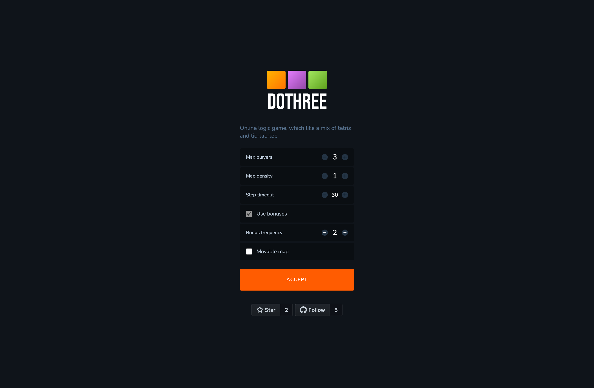

## 

Online logic game, which like a mix of tetris and tic-tac-toe.

The game involves from 2 to 5 players, each of which has its own color of cubes. Players take turns placing cubes in the cells of map, under which there must be baseground (cube of map or another player).
The winner is one, who first places 3 of his cubes in a row.

* ### __[Play now](http://dothree.neki.guru/)__
* ### __Screenshots__

